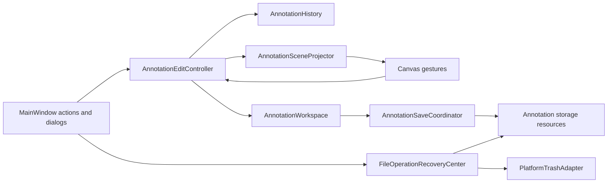

# Undo, Redo, Save Coordination, and File Recovery Design

Status: approved design; implementation has not started.

## Outcome

LabelImg Enhanced will have two deliberately separate recovery systems:

1. Per-image annotation Undo and Redo for current-image document edits.
2. A session-only recent file operations center for cross-file deletion, annotation clearing, synchronized rename, and batch review-state recovery.

`Ctrl+Z`, `Ctrl+Y`, and `Ctrl+Shift+Z` operate only on the current image's annotation history. They never restore deleted files, reverse file-list selection, or undo a batch file operation. File operation recovery is explicit from the File menu and always confirms before changing the filesystem.

The complete product vocabulary and edge-case policy live in `CONTEXT.md`. ADR 0008 chooses bounded immutable snapshots for annotation history; ADR 0009 coordinates saves and conflicts by physical storage resource.

## Scope

Annotation history includes:

- create a labeled box;
- delete one or many selected boxes;
- duplicate selected boxes;
- paste boxes;
- copy the previous image's boxes;
- move, resize, edge drag, vertex drag, and arrow-key nudge;
- edit a box label, difficult flag, line color, or fill color;
- change the current image review state.

Annotation history excludes:

- Canvas and label-list selection;
- box visibility;
- zoom, pan, filters, overlap-cycle position, hover, and editing mode;
- default drawing colors and other preferences;
- copying without pasting;
- image navigation and file-list selection;
- output format and destination path;
- global candidate-label and YOLO vocabulary maintenance;
- load-time clamping of out-of-bounds coordinates;
- every cross-file operation.

## Architecture



The boundaries are:

- `AnnotationHistory` is Qt-free and owns immutable per-image histories, cursors, revision identities, saved-baseline identities, retention, and branch rules.
- `AnnotationEditController` is the only annotation mutation boundary. It captures snapshots, commits or cancels edit transactions, executes Undo and Redo, updates derived state, and routes saves.
- `AnnotationSceneProjector` converts between Canvas/label-list state and immutable snapshots under signal guards.
- `AnnotationWorkspace` owns active document choice, format adapters, candidate labels, YOLO vocabulary, image-to-resource mapping, and workspace identity.
- `AnnotationSaveCoordinator` owns fingerprints, resource queues, immutable save requests, atomic file replacement, conflicts, and baseline acknowledgements.
- `FileOperationRecoveryCenter` owns the 20-entry session log and recovery preflight. It does not call or depend on annotation Undo and Redo.
- `PlatformTrashAdapter` returns an opaque recovery identity or explicitly reports that only manual trash recovery is available.

`MainWindow` remains composition and presentation. It must not contain inverse edit logic or manipulate a history cursor directly.

At rest, the controller's current immutable revision is the canonical annotation document. Canvas shapes are its Qt projection. During an open mouse or keyboard gesture, Canvas is a transient working copy; commit captures the next canonical revision and cancel projects the prior one. The existing `SelectionSet` remains canonical only for transient selection. Saves build adapter documents from immutable revisions and never recapture a mutable Canvas when a timer fires.

## Proposed source layout

- `src/labelimg/annotation_history.py`
  - immutable snapshot and history dataclasses;
  - per-image cursor and branch logic;
  - saved-revision identity;
  - retention and LRU eviction;
  - prepared Undo/Redo step tokens.
- `src/labelimg/annotation_editing.py`
  - Qt-aware edit controller;
  - Canvas/label-list snapshot capture and projection;
  - selection result policy;
  - shortcut routing and history action presentation helpers.
- `src/labelimg/annotation_storage.py`
  - storage target and resource keys;
  - fingerprints;
  - save request batching;
  - atomic single-file and rollback-capable multi-file writes;
  - resource conflict state.
- `src/labelimg/file_recovery.py`
  - recovery entries, preflight, execution, and status;
  - platform trash adapter protocol;
  - Windows and portable implementations.
- `src/labelimg/annotation_workspace.py`
  - remains the document/format facade;
  - delegates resource writes to `AnnotationSaveCoordinator`;
  - gains active-document choice, candidate derivation, and YOLO vocabulary ownership.
- `src/labelimg/canvas.py`
  - emits gesture lifecycle signals;
  - exposes cancel/restore hooks for an unfinished gesture;
  - does not own annotation history.
- `src/labelimg/app.py`
  - creates actions and dialogs;
  - delegates every document mutation to `AnnotationEditController`;
  - removes direct mutation-to-`set_dirty()` wiring.

## Immutable history state

An annotation snapshot contains no `QImage`, pixmap, painter, widget, list item, or file bytes.

```python
@dataclass(frozen=True)
class AnnotationBoxState:
    session_id: int
    label: str
    points: tuple[tuple[float, float], ...]
    line_rgba: tuple[int, int, int, int] | None
    fill_rgba: tuple[int, int, int, int] | None
    difficult: bool


@dataclass(frozen=True)
class AnnotationSnapshot:
    image_key: str
    image_size: tuple[int, int]
    boxes: tuple[AnnotationBoxState, ...]
    verified: bool
    questioned: bool
```

Box tuple order is annotation order. `session_id` is allocated monotonically inside one workspace session and is never serialized by Pascal VOC, YOLO, or CreateML writers.

Runtime `Shape` receives an internal session identity when projected. `Shape.copy()` deliberately produces an unowned copy; the edit controller allocates a new identity only when that copy becomes a committed duplicate, paste, or previous-image result.

Snapshots use structural sharing: an unchanged box reuses its prior frozen `AnnotationBoxState`, and adjacent revisions allocate only changed box states plus a new ordered tuple. Retention accounting counts uniquely retained state objects rather than multiplying the full logical document size by every snapshot.

A transition stores:

- source revision identity;
- destination revision identity;
- action kind;
- affected session identities;
- affected count;
- optional old/new label text for presentation;
- estimated retained byte cost.

The transition does not store a callback, `Shape`, widget pointer, or operation-specific inverse function.

## History interface

The deep module exposes intent-level methods:

```python
class AnnotationHistory:
    def open_image(self, image_key, snapshot, saved_baseline): ...
    def begin_edit(self, image_key, before, description): ...
    def commit_edit(self, token, after, affected_ids): ...
    def cancel_edit(self, token): ...

    def prepare_undo(self, image_key): ...
    def prepare_redo(self, image_key): ...
    def commit_step(self, step_token): ...
    def abort_step(self, step_token): ...

    def mark_saved(self, image_key, revision_id, target, fingerprint): ...
    def rebase(self, image_key, snapshot, baseline): ...
    def migrate_images(self, path_mapping): ...
    def remove_images(self, image_keys): ...
    def clear_workspace(self): ...
    def view(self, image_key): ...
```

Only one edit or history-step token may be open for one image. Nested mutations fail fast in tests and are not silently combined.

The controller prepares an Undo or Redo step, projects the target snapshot, and commits the cursor only after projection succeeds. If projection fails, it projects the source snapshot and aborts the step. Failure of both projections enters the degraded state defined below.

## Edit transaction lifecycle

Every mutation follows one path:

1. Capture the complete pre-edit snapshot.
2. Start one edit transaction with an action description.
3. Apply the user's complete intention.
4. Cancel if the user cancels or the resulting annotation snapshot is equal to the source.
5. Allocate and retain the complete transition.
6. If allocation or recording fails, restore the pre-edit snapshot.
7. Commit the transition, clear only this image's Redo branch, refresh derived candidates, update menu/status state, and schedule saving if dirty.

Programmatic history projection, document load, workspace rebase, and file-operation rebase execute inside a projection guard. Widget signals emitted during the guard cannot begin edits.

### Operation boundaries

| Operation | Transaction start | Commit | Cancel/no-op |
| --- | --- | --- | --- |
| New box | first drawing point | valid geometry plus confirmed label | label cancel or invalid geometry |
| Existing label/properties | dialog open or direct control activation | one accepted changed result | cancel or unchanged value |
| Left drag move/resize/edge/vertex | mouse press on a mutation target | mouse release | `Esc`, `Ctrl+Z`, lost mouse grab, or unchanged geometry |
| Right-drag move/copy | right-drag activation | chosen Move or Copy menu action | menu dismissal |
| Arrow nudge | first accepted arrow press | all held arrow keys released or Canvas loses focus | no coordinate changed |
| Delete/duplicate/paste/copy previous | immediately before command | complete resulting scene | empty target or command failure |
| Current review state | before toggle | complete mutually exclusive review state | no change or mutation failure |

Arrow auto-repeat events mutate inside the same open nudge transaction. Pressing another arrow while one remains held stays in that transaction; release of the final held arrow commits it. `Ctrl+Z/Y` keyboard auto-repeat is ignored.

If a mouse gesture loses its grab before release, it is canceled because the user never committed it. If an arrow hold loses focus, its already-applied movement is committed once because canceling visible keyboard movement on focus change is more surprising than ending the gesture.

Copy Previous preserves the current observable command meaning: it replaces the current image's box set with copies of the previous image's current session document. If the previous image has retained in-memory state, that state is the source; otherwise its selected active stored document is loaded. An unresolved multi-format source must be selected first. The created result is captured once, so later source edits cannot affect Redo. The command retains its immediate save request, but that save is revision-bound and does not clear history.

Current-image review toggles likewise retain their immediate save request. All other normal annotation mutations use the 200ms autosave debounce when autosave is enabled.

## Canvas and MainWindow changes

The current `Canvas.shapeMoved` signal fires for every mouse move and arrow repeat and is connected directly to `MainWindow.set_dirty`. That connection must be removed.

Canvas adds intent-level signals:

- `annotationGestureStarted(kind, affected_shapes)`;
- `annotationGestureCommitted(kind, affected_shapes)`;
- `annotationGestureCanceled()`;
- `nudgeStarted(shape)`;
- `nudgeCommitted(shape)`.

Canvas retains the pre-gesture geometry necessary for immediate cancellation. The controller retains the complete pre-document snapshot necessary for atomic history and failure recovery.

All current mutation entry points in `MainWindow` delegate to the controller:

- `new_shape`;
- `edit_label`;
- `button_state`;
- `label_item_changed` when text changes;
- `copy_selected_shape`;
- `delete_selected_shape`;
- `choose_shape_line_color`;
- `choose_shape_fill_color`;
- `copy_shape`;
- `move_shape`;
- `paste_copied_bounding_boxes`;
- `copy_previous_bounding_boxes`;
- `verify_image` and `question_image`.

Visibility changes, `choose_color1`, display-label options, selection, and view controls bypass the edit controller and do not dirty the document.

### Existing dirty-call migration inventory

| Current source | New owner |
| --- | --- |
| `change_format` | storage-target state; no annotation transition |
| `edit_label` | one property edit transaction |
| `button_state` | one difficult-property transaction |
| `shape_from_annotation` / `load_annotation_document` clamping | clean load-time normalization |
| `canvas.shapeMoved -> set_dirty` | removed; gesture lifecycle transaction |
| `copy_selected_shape` | duplicate transaction |
| `label_item_changed` text branch | label transaction |
| `label_item_changed` check-state branch | visibility view state |
| `new_shape` | committed creation transaction |
| `choose_color1` | default drawing preference; no dirty state |
| `delete_selected_shape` | bulk delete transaction |
| `choose_shape_line_color` / `choose_shape_fill_color` | property transaction |
| `copy_shape` / `move_shape` | right-drag copy or move transaction |
| `paste_copied_bounding_boxes` | paste transaction |
| `toggle_image_status` | review-state transaction plus immediate revision-bound save |

Every current `set_clean()` call is replaced by either a successful baseline acknowledgement, an explicit rebase, or workspace teardown. Loading, file-list refresh, and an attempted save cannot directly claim cleanliness.

## Snapshot projection

Projection is a whole-scene operation:

1. Capture focus, zoom, pan, editing mode, filters, and visibility keyed by surviving session identity.
2. Block Canvas, label-list, difficult-button, and related widget mutation signals.
3. Rebuild shapes in exact snapshot order and rebuild the two label-list maps.
4. Preserve visibility for identities existing before and after; restored or new identities default visible.
5. Apply the result selection:
   - box action: exactly the surviving affected boxes;
   - one survivor: active;
   - multiple survivors: last in annotation order active;
   - no survivor: no active box;
   - non-box action: preserve selection and active box.
6. Scroll the label list only enough to reveal the active item without taking focus.
7. Clear hover and overlap-cycle caches.
8. Restore focus, zoom, pan, modes, and filters.
9. Release signal guards and repaint once.

An exception at any step causes full projection of the source snapshot. Incremental best-effort projection is forbidden.

## Per-image history and workspace lifecycle

Histories are keyed by canonical absolute image path inside a workspace session.

- Navigating between images retains each history.
- Rename transactionally migrates histories, active-document choice, dirty state, conflicts, pending saves, selection paths, and current-image identity.
- Image deletion removes its in-memory history.
- Restoring a deleted image starts from the restored files as a new baseline with no old history.
- Explicitly loading another annotation document rebases that image.
- Clear annotations and cross-file review edits rebase only successful targets.
- Opening another image directory, changing the global save directory, or restarting ends the session and clears all histories.

A global save-directory change preflights the new directory and current document before committing. On success, it loads the new directory's document for the current image or a clean empty baseline. On failure, every old-workspace state remains unchanged.

## Multiple annotation formats

When more than one supported annotation document exists for an image:

- no format precedence is applied silently;
- the file list marks the image as awaiting document selection;
- unresolved files contribute no candidate labels;
- first access presents format, full path, and modification time;
- canceling the chooser cancels image navigation;
- the chosen document is active for the session and becomes the clean baseline;
- unchosen files remain untouched.

Saving to another format makes the new target active for the current session and preserves the old file. A later session prompts again.

Format and path are storage-target state, not annotation history. Changing them makes the image save-required but `Ctrl+Z` never changes them.

## Dirty state and saved baselines

Each image retains:

- current annotation revision;
- current storage target;
- saved annotation revision identity;
- saved target;
- fingerprint of the physical resource version corresponding to that baseline;
- optional save request currently in flight.

Dirty is exact:

```text
current revision != saved revision
or current storage target != saved target
```

The saved revision may be older than the retained Undo window. Its identity and fingerprint remain independent from evictable history.

Annotation-resource fingerprints contain existence, byte length, nanosecond modification time, and SHA-256 of the complete annotation bytes. Image fingerprints contain existence, dimensions, byte length, modification time, and a streaming SHA-256 so replacement by a same-size image is still detected. An absent resource has an explicit sentinel fingerprint. Fingerprints are captured after successful load/write and checked again immediately before commit; path names alone are never treated as identity.

Load-time coordinate clamping is a deterministic clean in-memory representation paired with the original file fingerprint. It creates no history, dirty state, or automatic write. A later real edit and save may persist those normalized coordinates.

Saving binds to an immutable revision and target. Completion acknowledges only the exact version actually written. If the user edits or moves history while the write is active, the newer current version stays dirty and is queued for a later save.

Save failure never moves a baseline or clears history.

## Save coordination and atomic files

Resource keys are canonical physical identities:

- Pascal VOC: one XML path;
- YOLO: one annotation TXT path plus the shared `classes.txt` vocabulary path;
- CreateML: one shared JSON collection path.

Requests sharing any key serialize. Locks are acquired in sorted canonical-key order to prevent deadlock. The current GUI-thread implementation may execute synchronously, but requests and acknowledgements still use immutable revision identities so future asynchronous execution cannot corrupt baselines.

### Single file

Write a peer temporary file, flush it, then atomically replace the destination. A failed replacement leaves the old resource and baseline.

### YOLO multi-file transaction

Stage the TXT and any changed class vocabulary first. Preflight all fingerprints again immediately before commit. Replace each destination using rollback backups; acknowledge no baseline until all replacements succeed. If replacement fails, restore every already-replaced destination. A failed rollback marks the resource conflicted and prevents autosave.

YOLO candidate labels and class indices are different models:

- candidates show only classes currently used by committed boxes in the workspace;
- existing YOLO indices never reorder or disappear;
- a new index is reserved on first committed use;
- an unused reservation alone does not make an image dirty;
- a later YOLO save persists the stable vocabulary.

### CreateML collection transaction

The coordinator retains the last-known complete collection model and fingerprint. Waiting requests coalesce the latest revision per image, update one collection model, and atomically replace one JSON file. The entire batch succeeds or fails; no image baseline advances on failure.

## Autosave

Autosave remains debounced by 200ms but is revision-aware and resource-aware.

- A new edit, Undo, or Redo invalidates an older pending request.
- Returning to the complete saved baseline cancels the pending write.
- Landing on another dirty state schedules its current immutable revision.
- Requests for one shared collection coalesce.
- A conflict pauses autosave for every dependent image.
- Degraded images cannot autosave.

Autosave never reads a mutable live Canvas after it has been queued.

## Coordination with file operations

Cross-file operations acquire the same canonical resource leases as saving. They cannot race an active or queued save.

- Image deletion waits for active writes, cancels queued writes for successful targets, removes their histories, and never allows a stale save to recreate deleted annotation files. Per the approved product rule, deletion does not prompt about unsaved Canvas edits.
- Annotation clearing and batch review wait for active writes, cancel obsolete queued writes, execute against verified current resources, and rebase only successful targets.
- Synchronized rename drains active writes, transactionally changes physical paths, then migrates histories, active documents, dirty revisions, conflicts, and any still-valid pending save requests to the new canonical keys.
- Recovery operations take the same leases and run only after their complete preflight remains valid under lock.

The lock acquisition order is shared with normal save coordination, preventing deadlock between a save, rename, clear, and recovery attempt.

## External conflicts

Fingerprints are checked on explicit reload and immediately before every save commit. No continuous filesystem watcher is required.

Conflict state belongs to the resource:

- per-image file conflict marks one image;
- CreateML collection conflict marks all images in that collection;
- YOLO vocabulary conflict pauses every write sharing that vocabulary.

Autosave conflict is non-modal. Editing and history continue, navigation remains allowed, the file list shows the conflict, and saving is paused.

Resolution choices are:

- Load external: replace the in-memory resource model and rebase dependent histories.
- Overwrite external: atomically write the retained resource model plus current in-memory edits and move baselines only on success.
- Cancel: preserve conflict, content, history, and dirty state.

CreateML load/overwrite is collection-wide and never merges individual records. A collection action that discards multiple images' changes requires a second confirmation with affected and dirty counts.

Closing with conflicts presents one resource-level summary. Each resource requires an explicit choice; an explicit apply-to-all action is allowed. Resources commit independently. A later failure preserves successful resolutions, aborts closing, and leaves only unresolved rows for the next attempt.

Closing or switching workspaces first drains active writes and then presents one summary for any remaining dirty images. Each row chooses Save or Discard; Cancel aborts the close/switch. Save failure keeps that image dirty and aborts the transition. Discard reloads its verified stored baseline and clears that image's history. Conflict rows use the conflict resolution flow instead of offering an unsafe ordinary discard.

## Degraded state

If target projection and rollback projection both fail:

1. clear only the affected image's history;
2. attempt to load the fingerprint-verified stored document;
3. if successful, establish it as a clean rebase;
4. otherwise retain the last constructible in-memory snapshot as dirty and enter degraded state.

Degraded state:

- disables annotation creation and mutation;
- disables Undo, Redo, and autosave;
- allows view, selection, copying, reload, close, and rescue Save As;
- requires rescue Save As to a previously nonexistent path;
- establishes successful rescue output as a clean baseline with empty history;
- never overwrites the original or another existing annotation file.

## Shortcut and menu routing

Edit menu order begins with:

1. Undo …
2. Redo …
3. separator
4. existing edit actions.

Routing:

- Canvas, label list, and non-text MainWindow areas: annotation history.
- `QLineEdit`, `QTextEdit`, `QPlainTextEdit`, spin-box editors, and editable combo boxes: native widget history.
- File list and descendants: no annotation Undo or Redo.
- Modal dialogs: suspend MainWindow history shortcuts.

Implement routing with a `ShortcutOverride`/`KeyPress` event filter that classifies `QApplication.focusWidget()` before consuming the sequence. Do not register a window-wide QAction shortcut that can preempt native text editing. The menu action displays the standard key sequence but invokes the same controller command as the router. Auto-repeat events are consumed without advancing history.

`Ctrl+Z` cancels an unfinished drawing or geometry gesture before consulting history. That cancellation creates no Redo item. During a pending drawing or gesture, Redo is disabled and its shortcut gives a status message.

`Ctrl+Z`, `Ctrl+Y`, and `Ctrl+Shift+Z` ignore auto-repeat. No toolbar buttons or history panel are added in the first version.

Menu text is derived from the next transition, for example:

- `Undo Delete 3 boxes`;
- `Redo Move box`;
- `Undo Change label: cat → dog`.

Long label values are escaped and elided in the menu; the status bar may show the full text. Unavailable actions are disabled. Attempting Undo past an evicted boundary gives a status explanation distinct from an image that never had history.

File-list persistence conditions are orthogonal item-data roles rather than changes to selection painting. Dirty, conflicted, ambiguous-active-document, and degraded states use compact trailing markers and explanatory tooltips; they do not add blue leading blocks, replace the agreed translucent selection appearance, or change the gray hover appearance. History availability alone has no file-list marker.

## Candidate labels

Candidate labels are a derived set of labels currently used by committed annotation boxes in the active workspace:

- include unambiguous unopened stored documents;
- include chosen active documents;
- include committed unsaved in-memory documents;
- use the in-memory side of an unresolved external conflict;
- exclude unresolved multi-format images;
- exclude typed-but-canceled, predefined-only, or previously-used-only labels.

Undo of the final workspace use removes the candidate. Redo restores it. Ordering is `(label.casefold(), label)`, so case-only variants remain distinct and deterministic.

## File operation recovery center

The File menu gains `Recent File Operations…`. The center shows at most 20 entries, newest first. Each row has:

- operation type and time;
- successful target count;
- current status: recoverable, conflict, manual trash, restored, or unavailable;
- a Recover action when actionable.

Entries are session-only and cleared by workspace switch or application exit. Restored entries remain visible but cannot run twice.

Supported entries:

- image deletion: original image/annotation paths plus trash identities;
- annotation clearing: prior annotation resources plus post-clear fingerprints;
- synchronized rename: complete forward/inverse mapping;
- batch review change: prior and resulting review fields.

Recovery always performs whole-entry preflight. It never overwrites, invents suffixes, or silently restores a subset.

### Windows trash adapter

Replace legacy `SHFileOperationW` with `IFileOperation` using `FOFX_RECYCLEONDELETE` and a progress sink. `PostDeleteItem` returns `psiNewlyCreated`, the `IShellItem` representing the item in the Recycle Bin. Retain that opaque item identity for the workspace session and use `IFileOperation.MoveItem` to restore it to the original parent/name after collision preflight.

Use a Windows-only conditional dependency on `comtypes>=1.4.16,<2`; it is pure Python and supports the project's Python 3.14 runtime. Do not parse private `$I`/`$R` files or guess by filename and deletion time.

Authoritative platform references:

- [IFileOperationProgressSink::PostDeleteItem](https://learn.microsoft.com/en-us/windows/win32/api/shobjidl_core/nf-shobjidl_core-ifileoperationprogresssink-postdeleteitem)
- [IFileOperation operation flags](https://learn.microsoft.com/en-us/windows/win32/api/shobjidl_core/nf-shobjidl_core-ifileoperation-setoperationflags)
- [SHGetIDListFromObject](https://learn.microsoft.com/en-us/windows/win32/api/shobjidl_core/nf-shobjidl_core-shgetidlistfromobject)
- [comtypes package](https://pypi.org/project/comtypes/)

If Windows returns no newly created recycle item, the adapter must not create an actionable recovery entry and must report a hard trash failure; no permanent-delete fallback is invoked by LabelImg.

### Other platforms

Use `QFile.moveToTrash` only when it succeeds. A nonempty returned trash path is an actionable identity. A successful trash operation with no usable returned identity creates a manual-trash entry after the agreed warning. If trash is unavailable, block deletion rather than permanently deleting.

## File recovery semantics

### Deleted images

- every original path must be unoccupied;
- every trash identity must still resolve;
- restore all or roll back all;
- refresh and naturally sort the file list;
- select every restored image;
- preserve the current image unless the workspace was empty;
- establish restored annotation documents as new clean baselines.

### Cleared annotations

- every target must still be empty as produced by the clear;
- any stored annotation or unsaved Canvas content blocks the entire entry;
- CreateML validates the complete post-clear collection fingerprint;
- recovery restores the exact prior documents as new baselines;
- no merge is offered.

### Rename

- validate a unique complete inverse mapping and unoccupied former paths;
- rename images and all annotation resources transactionally;
- preserve content edits made under new names;
- migrate current image, selection, history, active document, dirty state, and pending save identities;
- a successful inverse rename remains a new filesystem state, not byte rollback.

### Batch review

- every current review field must still equal the operation result;
- later box edits are preserved;
- any later review change blocks the whole entry;
- restore prior review fields atomically;
- rebase affected annotation histories after success.

## Retention

- maximum 100 transitions per image;
- soft target approximately 256 MiB across the workspace;
- LRU is updated by history access, edit, Undo, or Redo, not by passive file-list painting;
- trim least-recently-used inactive histories first while retaining a contiguous window around each current cursor;
- remove the farthest Undo-side edge first, then the farthest Redo-side edge when no older Undo edge remains;
- never split one transition;
- preserve current snapshots and saved-baseline identities;
- permit one newest transition to exceed the soft target after all other history is evicted;
- if that transition cannot be allocated, fail and roll back the edit.

Redo transitions count toward the same limits. Eviction never moves a cursor to fabricate a clean state. Each history records whether an earlier Undo boundary was evicted so status feedback is accurate.

## Failure handling

- No-op: no transition, no dirty change, no Redo clearing.
- Edit exception before commit: project source snapshot; no transition.
- History allocation failure: project source snapshot; no transition.
- Undo/Redo projection failure plus successful rollback: cursor unchanged, entry retained for retry, error shown.
- Projection and rollback failure: per-image degraded flow.
- Save failure: baseline and history unchanged.
- Resource conflict: pause resource saves; retain current histories.
- File operation partial success: recovery entry records only successful targets.
- File recovery execution failure: roll back already restored/moved targets; if rollback fails, leave the entry conflicted and report every exact path.

Every failure result is structured. UI code does not infer success from an absent exception alone.

## Implementation sequence

1. Add pure history dataclasses, cursor logic, retention, and unit tests.
2. Add session identities and guarded scene capture/projection tests.
3. Introduce the edit controller and migrate one mutation family at a time.
4. Add gesture lifecycle signals and arrow-hold coalescing.
5. Add Edit menu actions, shortcut routing, status messages, and help text.
6. Replace global dirty handling with per-image revision/baseline state.
7. Add resource fingerprints and save coordinator; make current synchronous saves revision-aware.
8. Add atomic resource writes, shared CreateML batching, YOLO vocabulary coordination, and conflict UI.
9. Add active-document choice and transactional workspace switching.
10. Add the file recovery center and fake trash adapter tests.
11. Replace Windows trash deletion with the `IFileOperation` adapter and add a Windows integration smoke test.
12. Run full source and isolated installed-package validation.

Each phase must preserve passing tests before the next mutation family moves behind the controller. Direct `set_dirty()` calls are removed only when their behavior has an equivalent transaction or explicit view-state classification.

## Acceptance matrix

### Pure history

- per-image independent Undo/Redo;
- save does not clear history;
- new edit clears only that image's Redo branch;
- no-op and canceled edits create no transition;
- saved baseline remains exact after eviction;
- 100-entry and soft-memory retention;
- oversized newest transition;
- rename migration, delete removal, and rebase;
- retry after recoverable application failure.

### Edit atomicity

- new box plus label confirmation is one entry;
- canceled label dialog is no entry;
- existing label/properties confirmation is one entry;
- drag emits one entry regardless of move-event count;
- canceled drag restores geometry and preserves prior Redo;
- arrow auto-repeat is one entry;
- bulk delete/duplicate/paste/copy previous is all-or-nothing;
- Redo restores captured results rather than rereading clipboard/source or rerunning geometry.

### Projection and view state

- exact label-list, draw-layer, hit-test, and overlap-cycle order;
- surviving visibility preserved;
- restored boxes visible by default;
- result selection and active-box rules;
- focus, zoom, pan, mode, and filters preserved;
- list scroll without focus theft;
- hover and overlap cache reset;
- projection signals do not recursively record history.

### Shortcuts and UI

- Canvas, label list, non-text area routing;
- native text Undo/Redo;
- file-list focus does nothing;
- modal suspension;
- no keyboard auto-repeat;
- pending drawing/gesture Undo cancellation;
- Redo disabled during pending work;
- dynamic menu text, counts, elision, enabled state, and status feedback.

### Persistence

- revision-bound manual and automatic saves;
- Undo before the 200ms timer never writes a stale state;
- save completion after a newer edit acknowledges only the written revision;
- failed save leaves dirty and history intact;
- empty Pascal VOC baseline;
- load-time clamping is clean, silent, non-history, and non-writing;
- format/path changes are save-required but not Undoable;
- multi-format chooser and cancel-navigation behavior;
- workspace switch preflight and rollback.

### Shared resources and conflict

- same-resource serialization and disjoint-resource concurrency;
- CreateML multi-image coalescing and atomic replacement;
- YOLO TXT/vocabulary transaction rollback;
- conflict detection before save/reload;
- non-modal autosave conflict;
- collection-wide resolution and second confirmation;
- close summary, apply-to-all, partial resource success;
- candidate labels use the in-memory conflict side.

### File recovery

- 20-entry retention and session reset;
- deletion token capture and exact restore;
- strict collision preflight;
- all-or-nothing recovery rollback;
- recovered selection/current-image behavior;
- clear-only-while-empty;
- inverse rename with later edits and history migration;
- field-level batch review recovery;
- shared CreateML fingerprints;
- manual-trash and no-trash fallbacks;
- restored entry cannot run twice.

### Validation

- run focused unit and offscreen Qt tests with isolated `LABELIMG_CONFIG_DIR`;
- run repository `tools/run_tests.py`;
- run direct or discovery variants for tests affected by package-name collisions;
- build the wheel;
- install it into an isolated environment without source-tree shadowing;
- rerun focused and full installed-package tests;
- perform a Windows GUI smoke test for shortcuts, resource conflicts, and recycle-bin restore.

## Non-goals for the first version

- persistent Undo/Redo across application restarts;
- a visual annotation history panel;
- arbitrary history-position jumping or preview;
- global `Ctrl+Z` for filesystem operations;
- automatic annotation or external-file merge;
- persistent recovery log across workspaces;
- recovering recycle-bin items after the application session ends;
- writing session annotation identities into annotation formats;
- silently choosing among multiple annotation formats;
- automatically deleting an old format after conversion.
